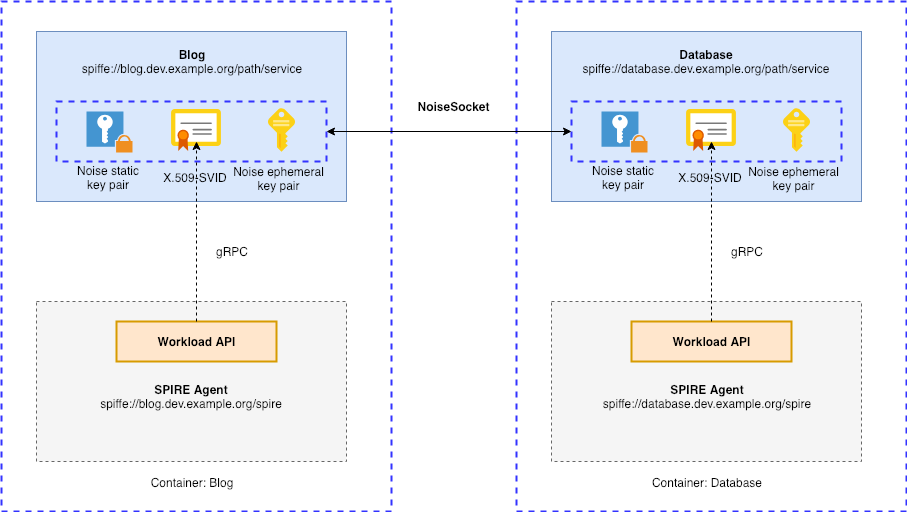

# SPIFFE with NoiseSocket

This example shows two applications that use [NoiseSocket](https://noisesocket.org/) protocol [implementation](https://github.com/go-noisesocket/noisesocket) in Golang and SPIFFE X.509 SVID certificates to establish a secure channel between themselves.

The example reproduces [SPIFFE Simple Verification scenario](https://github.com/spiffe/spiffe-example/tree/master/simple_verification), but it employs NoiseSocket instead of TLS.

## Warning

This is experimental code for demonstration purposes only, don't use it in production.

## Noise and NoiseSocket

Noise is a framework for specifying secure channel protocols based on the Diffie-Hellman key agreement.
The Noise Protocol is currently adopted and used by WhatsApp, WireGuard, and Lightning.
For more information, see Trevor Perrin’s talk at [Real World Crypto](https://www.youtube.com/watch?v=3gipxdJ22iM).
The nice feature is that Noise allows for use-case specific protocols. The specification describes more than 50 handshake patterns. One of the most generically useful patterns is the `XX` pattern, since it supports mutual authentication and transmission of static public keys.

[The NoiseSocket Protocol](https://noisesocket.org/spec/noisesocket/) allows to negotiate a particular Noise protocol and use it as a secure network protocol.

In according with the Noise specification, an application using a Noise protocol should determine whether a remote party's static public key is acceptable. And one of the methods to address this issue is to employ certificates which sign the static public key.

The main idea, of course, is to use X.509 SVID certificates within the SPIFFE approach for mutual authentication.

## Description

There are two entities (workloads within SPIFFE terminology) called `blog` and `database`
that have already gotten their [X.509 SVID](https://github.com/spiffe/spiffe/blob/master/standards/X509-SVID.md) via the `SPIFFE Workload API`.
In an X.509 SVID, the SPIFFE ID is set as a URI type in the Subject Alternative Name extension of an X.509 certificate.
The SVIDs are located in the corresponding `client/keys` and `server/keys` directories and contain special SPIFFE ID values that identify the entities.

SVIDs provide the following.
First, they are used to [authenticate](https://noiseprotocol.org/noise.html#security-considerations) Noise's static public keys within [`XX` pattern](http://noiseprotocol.org/noise.html#interactive-handshake-patterns-fundamental) via signing. 
Second, they are used to authorize `NoiseSocket` connections (accept or reject them) based on allowed SPIFFE IDs.

## Demo scenario 

### Components

The scenario simulates the presence of a blog service connecting to a database service. The database service allows ingress connection based on SPIFFE ID. It is suggested that the services have already had SPIFFE IDs as X.509 certificates.

X.509 SVID private keys will be used to sign NoiseSocket's static keys during a handshake.

This demo is composed of 2 containers: two workloads have already received their respective X.509 SVIDs.



### Run the demo

#### Prerequisites

- Linux 
- [Docker](https://docs.docker.com/install/)
- [Docker Compose](https://docs.docker.com/compose/install/)
- [Screen](https://www.gnu.org/software/screen)

###### 1. Clone this Repo.

###### 2. Build and Run the docker containers:
```
$ make demo
```

###### 3. Connect a multiplex console to the containers:
```
$ cd harness
$ make screen
```

###### 4. Run the protocol:

On the database console run:
```
$ ./run.sh
```

As a result, it will display the following:

```
Number of allowed SPIFFE URI IDs: 1
    spiffe://blog.dev.example.org/service/path
Starting server...

Access for spiffe://blog.dev.example.org/service/path entity has been permitted
```

On the blog console run:

```
$ ./run.sh
```

As a result, it will output the HTTP 200 OK success status response code:

```
200
```
###### 5. Clean all:

```
cd ..
make clean
```
